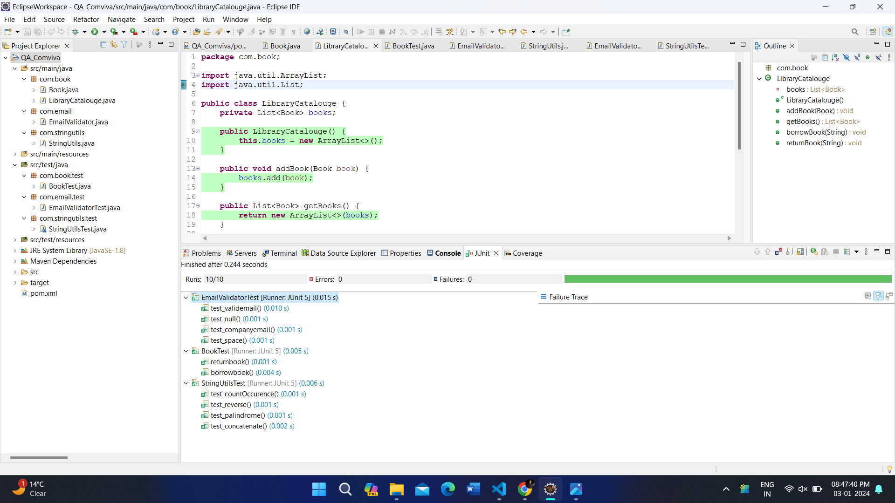

<p  align="right">

# <p align="center">Unit Testing</p>

## Code Coverage


## Unit Testing


<hr>

# <p align="center">Setting up Eclipse and JUnit testing dependencies</p>

- Download EclipseEE [Click here](https://www.eclipse.org/downloads/download.php?file=/technology/epp/downloads/release/2023-12/R/eclipse-jee-2023-12-R-win32-x86_64.zip)
- Create Maven Project
- Go to `File`>`New`>`Maven Project`
.png)
.png) 
Click `Finish`

## Go to `pom.xml` 
use the code below to setup `dependencies`
```xml
    <dependencies>
        <dependency>
            <groupId>org.junit.jupiter</groupId>
            <artifactId>junit-jupiter</artifactId>
            <version>5.10.1</version>
            <scope>test</scope>
        </dependency>
        <dependency>
            <groupId>org.junit.platform</groupId>
            <artifactId>junit-platform-suite-engine</artifactId>
            <version>1.10.1</version>
        </dependency>
        <dependency>
            <groupId>org.slf4j</groupId>
            <artifactId>slf4j-api</artifactId>
            <version>2.0.9</version>
        </dependency>
    </dependencies>
```

use the code below to setup `build`
```xml
    <build>
        <pluginManagement><!-- lock down plugins versions to avoid using Maven
            defaults (may be moved to parent pom) -->
            <plugins>
                <!-- clean lifecycle, see
                https://maven.apache.org/ref/current/maven-core/lifecycles.html#clean_Lifecycle -->
                <plugin>
                    <artifactId>maven-clean-plugin</artifactId>
                    <version>3.1.0</version>
                </plugin>
                <!-- default lifecycle, jar packaging: see
                https://maven.apache.org/ref/current/maven-core/default-bindings.html#Plugin_bindings_for_jar_packaging -->
                <plugin>
                    <artifactId>maven-resources-plugin</artifactId>
                    <version>3.0.2</version>
                </plugin>
                <plugin>
                    <artifactId>maven-compiler-plugin</artifactId>
                    <version>3.8.0</version>
                </plugin>
                <plugin>
                    <groupId>org.apache.maven.plugins</groupId>
                    <artifactId>maven-surefire-plugin</artifactId>
                    <version>3.2.3</version>
                    <!--                    <configuration>-->
                    <!--                        <test>test_suite.MyTestSuite</test>-->
                    <!--                    </configuration>-->
                </plugin>
                <plugin>
                    <artifactId>maven-jar-plugin</artifactId>
                    <version>3.0.2</version>
                </plugin>
                <plugin>
                    <artifactId>maven-install-plugin</artifactId>
                    <version>2.5.2</version>
                </plugin>
                <plugin>
                    <artifactId>maven-deploy-plugin</artifactId>
                    <version>2.8.2</version>
                </plugin>
                <!-- site lifecycle, see
                https://maven.apache.org/ref/current/maven-core/lifecycles.html#site_Lifecycle -->
                <plugin>
                    <artifactId>maven-site-plugin</artifactId>
                    <version>3.7.1</version>
                </plugin>
                <plugin>
                    <artifactId>maven-project-info-reports-plugin</artifactId>
                    <version>3.0.0</version>
                </plugin>
            </plugins>
        </pluginManagement>
        <plugins>
            <plugin>
                <groupId>org.apache.maven.plugins</groupId>
                <artifactId>maven-compiler-plugin</artifactId>
                <configuration>
                    <source>8</source>
                    <target>8</target>
                </configuration>
            </plugin>
            <plugin>
                <groupId>org.jacoco</groupId>
                <artifactId>jacoco-maven-plugin</artifactId>
                <version>0.8.10</version>
                <executions>
                    <execution>
                        <goals>
                            <goal>prepare-agent</goal>
                        </goals>
                    </execution>
                    <execution>
                        <id>report</id>
                        <phase>test</phase>
                        <goals>
                            <goal>report</goal>
                        </goals>
                    </execution>
                    <execution>
                        <id>jacoco-check</id>
                        <goals>
                            <goal>check</goal>
                        </goals>
                        <configuration>
                            <rules>
                                <rule>
                                    <element>PACKAGE</element>
                                    <limits>
                                        <limit>
                                            <counter>LINE</counter>
                                            <value>COVEREDRATIO</value>
                                            <minimum>0.9</minimum>
                                        </limit>
                                    </limits>
                                </rule>
                            </rules>
                        </configuration>
                    </execution>
                </executions>
            </plugin>
        </plugins>
    </build>
```

## Write Test Case
- write class in `src/main/java`
```java
package com.email;

public class EmailValidator {
	public boolean isValidEmail(String email) {
		return email.matches("[a-zA-Z0-9._%+-]+@[a-zA-Z0-9.-]+\\.[a-zA-Z]{2,}");
	}

	public boolean isCorporateEmail(String email) {
		return email.endsWith("comviva.com");
	}
	public boolean input(String email) {
		return email=="";
	}
	public boolean space(String email) {
		return email.contains(" ");
	}
}
```

- write test_class in `src/test/java`
```java
package com.email.test;

import static org.junit.jupiter.api.Assertions.assertFalse;
import static org.junit.jupiter.api.Assertions.assertTrue;

import org.junit.jupiter.api.Test;

import com.email.EmailValidator;

public class EmailValidatorTest {
	@Test
	void test_validemail() {
		EmailValidator obj = new EmailValidator();

		assertFalse(obj.isValidEmail("abc@gmail"));
		assertFalse(obj.isValidEmail("abc@com"));
		assertFalse(obj.isValidEmail("abc@gmailcom"));
		assertFalse(obj.isValidEmail("abc@gmail."));
		assertFalse(obj.isValidEmail("abc@.com"));
		assertFalse(obj.isValidEmail("@gmail.com"));
		assertFalse(obj.isValidEmail("@.com"));
		assertFalse(obj.isValidEmail("@gmail.com"));
		assertFalse(obj.isValidEmail("@gmailcom"));
		assertFalse(obj.isValidEmail("gmail.com@abc"));

		assertTrue(obj.isValidEmail("abc@gmail.com"));
	}

	@Test
	void test_companyemail() {
		EmailValidator obj = new EmailValidator();
		assertTrue(obj.isCorporateEmail("abc@comviva.com"));
	}

	@Test
	void test_null() {
		EmailValidator obj = new EmailValidator();
		assertFalse(obj.input("abc@comviva.com"));
		assertTrue(obj.input(""));
	}

	@Test
	void test_space() {
		EmailValidator obj = new EmailValidator();
		assertTrue(obj.space("abc xyz@comviva.com"));
	}
}
```

Now Perform,
> JUnit testing as `Right Click on Project`>`Run As`>`JUnit Test`

> Code Coverage as `Right Click on Project`>`Coverage As`>`JUnit Test`
